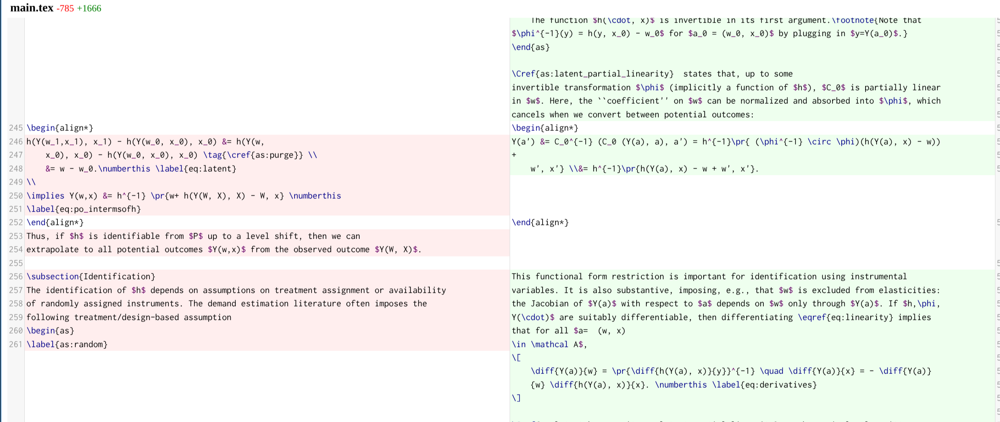

# `arxivdiff`: A CLI tool for diffing arxiv papers

A command-line tool to view a rich, side-by-side diff between two versions of an arXiv paper directly in your browser. This is meant as a tool for researchers to quickly see what has changed between versions of a paper, and for graduate students to understand how the sausage is made -- papers change a lot between versions!

This script automates the tedious process of downloading paper sources, extracting them, and setting up a comparison. It uses the power of `git` for an accurate diff and python `webdiff` to provide a beautiful and interactive browser-based view.

```
./arxivdiff 2503.23524 1 2
```

takes arxiv article `2503.23524` and compares version `1` with version `2`, launching a browser window that looks something like this:



Closing this browser tab (or pressing **`Ctrl+C`** in the terminal) will clean up all temporary files.

## Features

-   **Simple CLI:** Compare paper versions with a single command: `arxivdiff <paper_id> <v1> <v2>`.
-   **Browser-Based UI:** Launches `webdiff` for a powerful side-by-side or inline diff view in your default browser.
-   **Self-Contained Dependencies:** Uses a `uv` script block, so dependencies are managed automatically when run.
-   **Automatic Cleanup:** All downloaded files and git repositories are created in a temporary directory and are automatically deleted when you exit the program.
-   **Cross-Platform:** Works on macOS, Linux, and Windows.

## Requirements

-   [Python 3.12+](https://www.python.org/)
-   [Git](https://git-scm.com/) installed and available in your system's PATH.
-   [uv](https://github.com/astral-sh/uv) (strongly recommended) for running the script with automatic dependency management.

## Installation

The easiest way to run the script is directly from a cloned repository.

1.  **Clone the repository:**
    ```bash
    git clone https://github.com/apoorvalal/arxivdiff.git
    cd arxiv-diff
    ```

2.  **Make the script executable:**
    ```bash
    chmod +x arxivdiff
    ```

Now you can run the tool using `./arxivdiff`. If you are not using `uv`, ensure you have the required Python packages installed (listed in the frontmatter).

## Usage

Run the script from your terminal with three arguments: the arXiv paper ID, the "before" version number, and the "after" version number.

**Syntax:**
```bash
./arxivdiff <paper_id> <version_before> <version_after>
```

**Example:**
To compare version 1 and version 2 of the paper `1807.02099`:
```bash
./arxivdiff 2508.13076 1 2
```

### What Happens Next

1.  The script will print its progress as it downloads and extracts the source files for both versions.
2.  It will create a temporary `git` repository to prepare the comparison.
3.  Your default web browser will automatically open a new tab showing the side-by-side diff.
4.  The terminal will wait. When you are finished reviewing the diff, close the browser tab and press **`Ctrl+C`** in the terminal to exit the script and clean up all temporary files.

## How It Works

The script performs the following steps:

1.  **Parse Arguments:** Takes the paper ID and version numbers from the command line.
2.  **Construct URLs:** Creates the full URLs to download the `.tar.gz` source archives from `arxiv.org`.
3.  **Create Temp Directory:** Sets up a temporary directory that will be automatically deleted on exit.
4.  **Download & Extract:** Downloads and extracts the source code for both the old and new versions into separate subfolders.
5.  **Initialize Git Repo:** Initializes a new Git repository in the temporary location.
6.  **Commit Old Version:** Copies the files from the *old* version into the repo, stages them, and creates an initial commit.
7.  **Add New Version:** Copies the files from the *new* version into the repo, overwriting the old files. This creates a "dirty" working directory that `git` can compare against the last commit.
8.  **Launch Webdiff:** Runs the `git webdiff` command, which detects the changes and launches a local web server to display them in the browser.


## Limitations

In developing this tool, I discovered how messy the arxiv source files can be. If two versions of a paper have completely different source files (e.g., v1 was called `main.tex` and v2 is called `paper.tex`), the diff will not be very useful.

